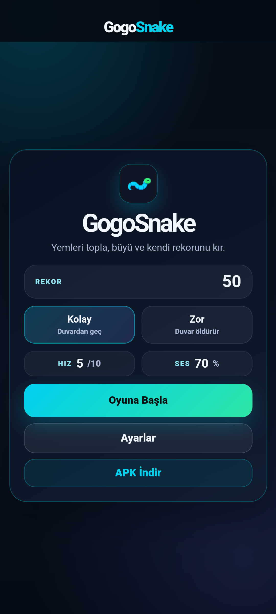
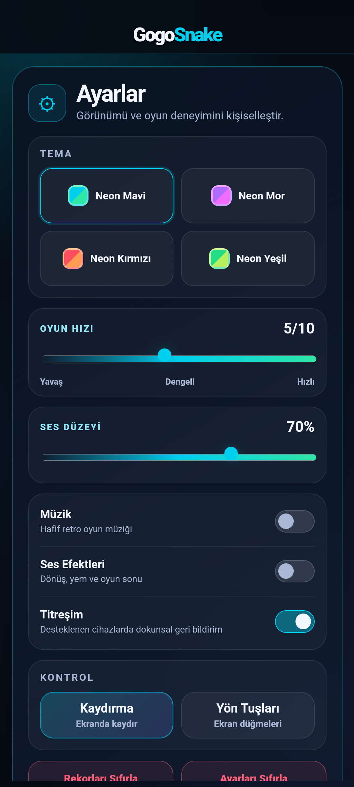
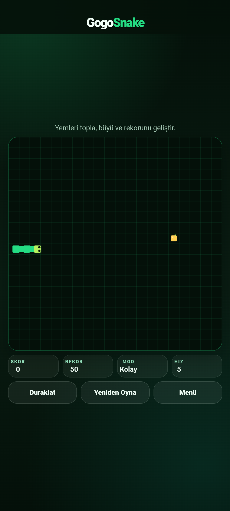

# GogoSnake

Pixel-art görünümünü koruyan, akıcı hareket sistemine ve dört neon renk temasına sahip mobil ve web yılan oyunu.

**GOGO STUDIO**<br>
Geliştirici: **Görkem H.**

[Canlı Demo](https://gorkemhc.github.io/gogosnake/) · [APK İndir](https://github.com/gorkemhc/gogosnake/releases/download/v1.0.0/GogoSnake.apk)

## Özellikler

- Sabit zaman adımlı oyun mantığı ve `requestAnimationFrame` tabanlı interpolasyon
- Neon Mavi, Neon Mor, Neon Kırmızı ve Neon Yeşil temaları
- Kalıcı tema, hız, ses, titreşim ve kontrol tercihleri
- Dokunmatik kaydırma, ekran yön tuşları ve klavye kontrolleri
- Kolay ve zor oyun modları
- Moda göre saklanan skor ve rekor sistemi
- Mobil safe-area desteği ve 360×800, 390×844, 412×915 düzenleri
- Çevrimdışı çalışabilen PWA ve yerel Android WebView paketi

## Ekran görüntüleri

| Ana menü | Ayarlar | Oyun |
| --- | --- | --- |
|  |  |  |

## Kontroller

- Mobil: oyun alanında kaydırma veya ayarlardan seçilebilen ekran yön tuşları
- Klavye: ok tuşları veya `WASD`
- Duraklat/devam et: `P` veya boşluk

## Teknolojiler

- HTML5, CSS ve JavaScript
- Canvas 2D
- Web Audio API
- Service Worker ve Web App Manifest
- Native Android `WebView`
- Gradle 9.1 ve Android Gradle Plugin 9.0.1

## Yerel web geliştirme

Kanonik web kaynakları `android/app/src/main/assets/www` klasöründedir. Bu klasörü herhangi bir statik HTTP sunucusuyla açabilirsiniz.

## Android build

Gereksinimler:

- Android Studio ve Android SDK
- Android API 35 veya üzeri derleme platformu
- JDK 25 ile Gradle 9.1

Windows üzerinde debug APK oluşturmak için:

```powershell
$env:JAVA_HOME = "C:\Program Files\Android\Android Studio\jbr"
.\android\gradlew.bat -p android :app:assembleDebug
```

Debug APK çıktısı `android/app/build/outputs/apk/debug/app-debug.apk` konumunda oluşur.

### v1.0.0 APK notu

Bu sürüm için ayrı bir üretim imzalama anahtarı yapılandırılmadığından Release varlığı olan `GogoSnake.apk`, Android’in debug sertifikasıyla imzalanmış test/dağıtım APK’sıdır. Kaynaklardaki `app-release-unsigned.apk` üretim için imzasızdır; mağaza dağıtımı öncesinde geliştiricinin kendi güvenli anahtarıyla imzalanmalıdır.

## Web yayını

GitHub Pages iş akışı kanonik web klasörünü doğrudan yayımlar; Android ve web sürümleri aynı HTML, CSS, JavaScript, görsel ve PWA dosyalarını kullanır.

## Lisans

Bu proje [MIT Lisansı](LICENSE) ile sunulur.
