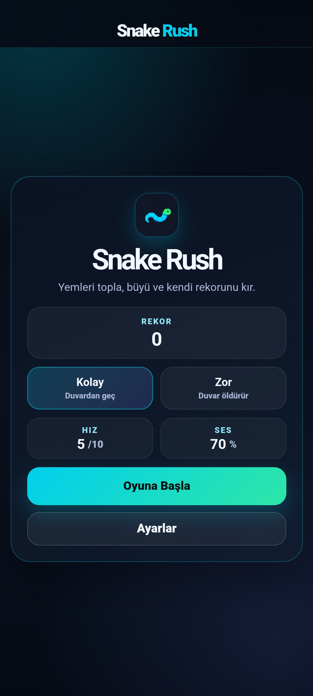
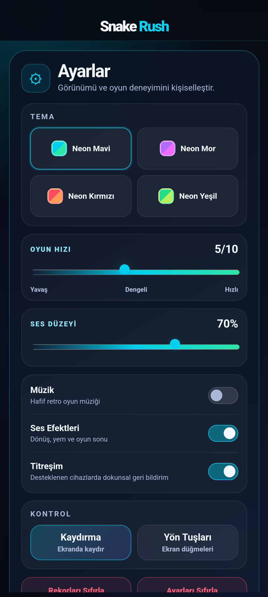
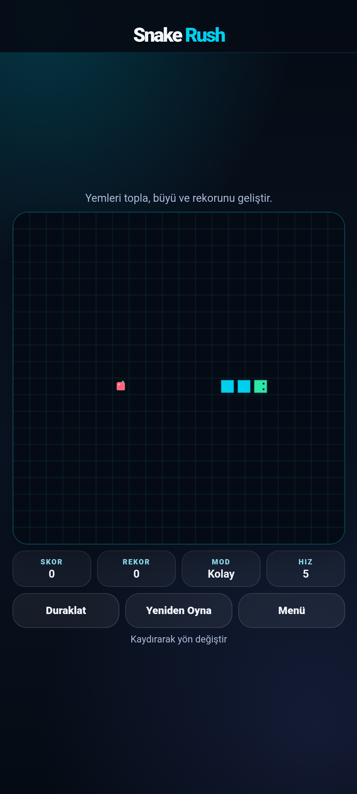
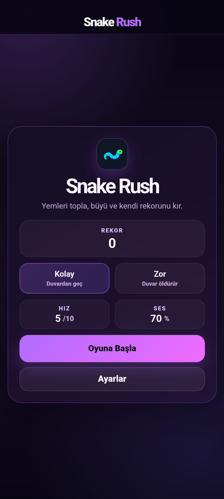
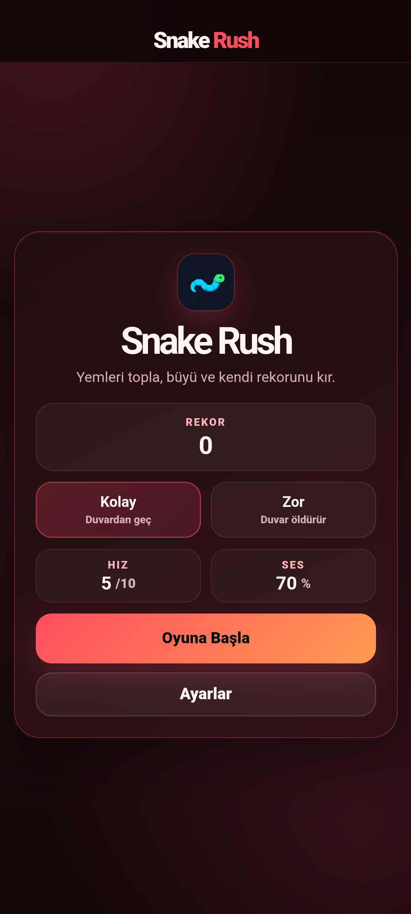
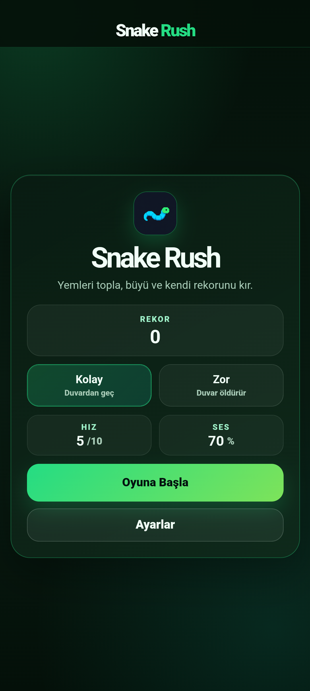

# Snake Rush

Klasik kare piksel yılan görünümünü koruyan; akıcı hareket, dört neon tema ve mobil dokunmatik kontroller sunan web ve Android yılan oyunu.

**GHC STUDIO**<br>
Geliştirici: **Görkem H.**

[Canlı Oyun](https://gorkemhc.github.io/SnakeRush/) · [APK İndir (v1.0.2)](https://github.com/gorkemhc/SnakeRush/releases/download/v1.0.2/Snake-Rush.apk)

[GitHub](https://github.com/gorkemhc) · [LinkedIn](https://www.linkedin.com/in/gorkemhicyilmaz/) · [E-posta](mailto:gorkemhcylmz0@gmail.com)

## Özellikler

- Eski tarz, birbirine bağlı yuvarlatılmış gövde segmentleri ve dairesel gözlü yılan başı
- Sabit zaman adımlı oyun mantığı ve `requestAnimationFrame` tabanlı görsel interpolasyon
- Neon Mavi, Neon Mor, Neon Kırmızı ve Neon Yeşil temaları
- Kalıcı tema, mod, hız, ses, titreşim ve kontrol tercihleri
- Dokunmatik kaydırma, ekran yön tuşları ve klavye kontrolleri
- Kolay ve zor oyun modları
- Moda göre saklanan skor ve rekor sistemi
- Mobil safe-area desteği ve küçük ekranlara uyumlu yerleşim
- Çevrimdışı çalışabilen PWA ve yerel Android `WebView` paketi

## Ekran görüntüleri

| Ana menü | Ayarlar | Oynanış |
| --- | --- | --- |
|  |  |  |

| Neon Mor | Neon Kırmızı | Neon Yeşil |
| --- | --- | --- |
|  |  |  |

## Kontroller

- Mobil: oyun alanında kaydırma veya ayarlardan seçilebilen ekran yön tuşları
- Klavye: ok tuşları veya `WASD`
- Duraklat/devam et: `P` veya boşluk

## Teknolojiler

- HTML5, CSS ve JavaScript
- Canvas 2D ve Web Audio API
- Service Worker ve Web App Manifest
- Native Android `WebView`
- Gradle 9.1 ve Android Gradle Plugin 9.0.1

## Yerel web geliştirme

Kanonik web kaynakları `android/app/src/main/assets/www` klasöründedir. Klasörü statik bir HTTP sunucusuyla açın; GitHub Pages iş akışı da aynı kaynakları yayımlar.

## Android build

Gereksinimler:

- Android Studio ve Android SDK
- Android API 35 veya üzeri derleme platformu
- Android Studio JBR (JDK 17 veya üzeri)

Windows üzerinde debug APK oluşturmak için:

```powershell
$env:JAVA_HOME = "C:\Program Files\Android\Android Studio\jbr"
.\android\gradlew.bat -p android :app:assembleDebug
```

Çıktı `android/app/build/outputs/apk/debug/app-debug.apk` konumunda oluşur.

### v1.0.2 APK imza notu

Projede üretim imzalama anahtarı bulunmadığından `Snake-Rush.apk`, Android debug sertifikasıyla imzalanmış kurulabilir test/dağıtım APK’sıdır. APK Signature Scheme v1 ve v2 doğrulaması başarılıdır. Mağaza dağıtımından önce geliştiricinin kendi güvenli üretim anahtarıyla imzalanmalıdır; depoda keystore veya parola tutulmaz.

## Android doğrulama geçmişi

- Pixel 7 sanal cihazı
- Android 16 / API 36
- Google APIs, Intel x86_64, normal sistem görüntüsü
- `adb` durumu: `device`
- Emülatörde doğrulanan uygulama sürümü: `1.0.1`

`v1.0.2` için web arayüzü masaüstü ve dar ekran boyutlarında kontrol edilmiş, JavaScript sözdizimi doğrulanmış ve yüklenebilir debug APK başarıyla oluşturulmuştur. Bu sürüm için ayrıca emülatör testi yapılmamıştır.

Gerçek emülatör test kanıtları `test-screenshots` klasöründedir. Akıcı oynanış kaydı yerel teslimde `test-videos/snake-rush-smooth-gameplay.mp4` olarak üretilir; büyük test videoları Git geçmişine eklenmez.

## Lisans

Bu proje [MIT Lisansı](LICENSE) ile sunulur.
